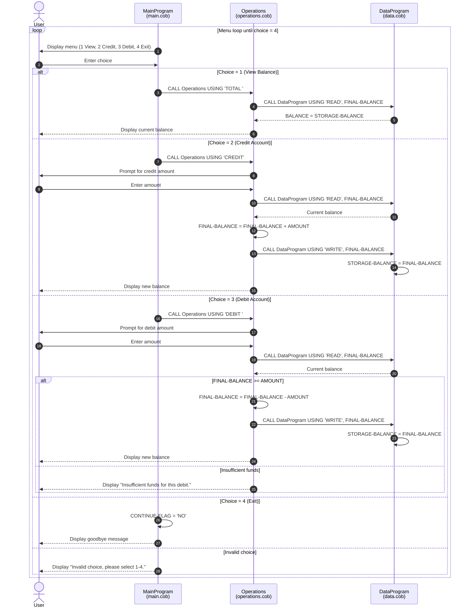

# COBOL Student Account System Documentation

This document explains the purpose of each COBOL file in `src/cobol`, the key operations implemented in the programs, and the business rules applied to student account balances.

## Overview

The application is a menu-driven account management system with three programs:

- `MainProgram` handles user interaction and menu flow.
- `Operations` applies account operations (view, credit, debit).
- `DataProgram` manages in-memory balance storage for read/write requests.

The programs communicate using COBOL `CALL ... USING` parameters.

## File Purposes

### `src/cobol/main.cob` (`MainProgram`)

Purpose:
- Provides the command-line menu for account actions.
- Repeats until the user selects Exit.
- Dispatches the selected operation to `Operations`.

Key logic:
- Displays options:
  - `1` View Balance
  - `2` Credit Account
  - `3` Debit Account
  - `4` Exit
- Maps user choices to operation codes passed to `Operations`:
  - `1 -> 'TOTAL '`
  - `2 -> 'CREDIT'`
  - `3 -> 'DEBIT '`
- Rejects unsupported menu input with an "Invalid choice" message.

### `src/cobol/operations.cob` (`Operations`)

Purpose:
- Executes account operations requested by `MainProgram`.
- Reads and writes balance through `DataProgram`.

Key operations:
- `TOTAL `:
  - Calls `DataProgram` with `READ`.
  - Displays the current balance.
- `CREDIT`:
  - Accepts credit amount from user.
  - Reads current balance.
  - Adds amount.
  - Writes updated balance.
  - Displays new balance.
- `DEBIT `:
  - Accepts debit amount from user.
  - Reads current balance.
  - Validates available funds.
  - Subtracts amount and writes updated balance only if funds are sufficient.
  - Displays insufficient funds message otherwise.

### `src/cobol/data.cob` (`DataProgram`)

Purpose:
- Acts as the data-access layer for account balance.
- Stores the account balance in working storage.

Key operations:
- `READ`:
  - Copies internal `STORAGE-BALANCE` into the caller-provided `BALANCE` field.
- `WRITE`:
  - Copies caller-provided `BALANCE` into internal `STORAGE-BALANCE`.

Data note:
- Balance is held in memory (`WORKING-STORAGE`), not persisted to a file or database.
- Initial balance defaults to `1000.00`.

## Student Account Business Rules

The current implementation enforces these rules:

1. A student account starts with a balance of `1000.00`.
2. Users may only select menu choices `1` through `4`.
3. Viewing balance does not modify account data.
4. Credits always increase balance by the entered amount.
5. Debits are only allowed when `current balance >= debit amount`.
6. If funds are insufficient, no balance update occurs.
7. Balance updates happen only through `DataProgram` `WRITE` calls.

## Known Constraints

- Data is session-only and resets when the program stops.
- No validation currently prevents negative, zero, or malformed transaction amounts.
- No support currently exists for multiple student accounts; there is one shared balance value.

## Suggested Next Improvements

- Add input validation for positive transaction amounts.
- Persist balances to a file or database.
- Introduce account identifiers to support multiple students.
- Add an audit trail for credits/debits.

## Sequence Diagram (Data Flow)

